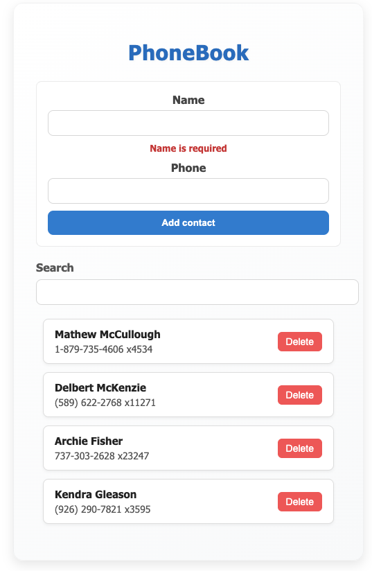

# 📘 Redux PhoneBook App

A simple and modern **PhoneBook application** built with **React**, **Redux Toolkit**, and **MockAPI.io**.  
This app allows users to manage their contacts (add, delete, filter) with data persisted on a mock backend.

---
## 📸 Preview



---

## 🚀 Demo
- **Live Demo (Vercel):** [Redux PhoneBook App](https://redux-phonebook-app.vercel.app/)  
- **GitHub Repository:** [Source Code](https://github.com/zekirovskii/redux-phonebook-app)

---

## 📦 Features
- 🔄 **State management** with Redux Toolkit  
- 🌐 **MockAPI integration** for contact storage  
- 📥 Fetch all contacts (GET)  
- ➕ Add a new contact (POST)  
- ❌ Delete contact by ID (DELETE)  
- ⏳ Loading & ⚠️ Error states handled in Redux store  
- 🧮 **Memoized selector** with `createSelector` for efficient filtering  
- 🎨 Component-level styling with **CSS Modules**

---

## 🛠️ Tech Stack
- [React 18](https://react.dev/) + [Vite](https://vitejs.dev/)  
- [Redux Toolkit](https://redux-toolkit.js.org/) & [React Redux](https://react-redux.js.org/)  
- [Axios](https://axios-http.com/)  
- [MockAPI.io](https://mockapi.io/)  
- [CSS Modules](https://github.com/css-modules/css-modules)  

---

## 📂 Project Structure

redux-phonebook-app/
│── public/
│── src/
│ ├── components/
│ │ ├── App/
│ │ │ ├── App.jsx
│ │ │ └── App.module.css
│ │ ├── ContactForm/
│ │ ├── ContactList/
│ │ ├── ContactItem/
│ │ ├── Filter/
│ │ └── Loader/
│ ├── redux/
│ │ ├── store.js
│ │ ├── contactsSlice.js
│ │ ├── filtersSlice.js
│ │ └── contactsOps.js
│ ├── main.jsx
│ └── index.css
│── package.json


---

## ⚙️ Installation & Setup
```bash
# Clone the repository
git clone https://github.com/zekirovskii/redux-phonebook-app.git

# Navigate into the project folder
cd redux-phonebook-app

# Install dependencies
npm install

# Run the development server
npm run dev

